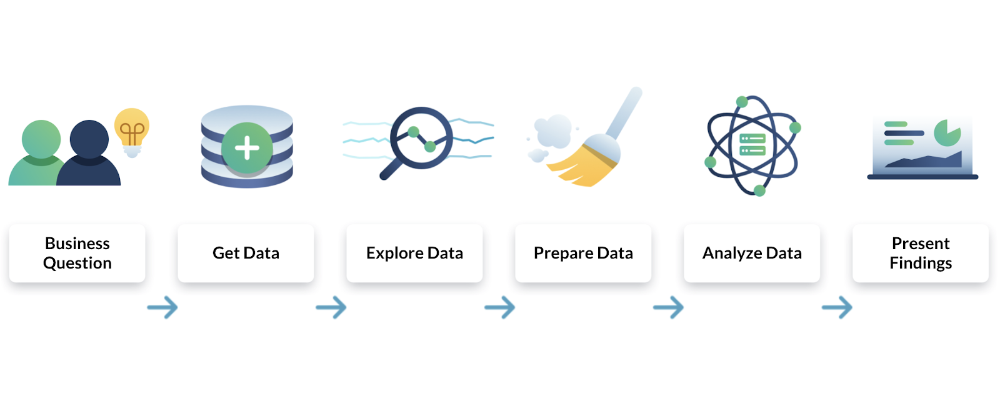

# My Data Analyst Portfolio

Welcome to my portfolio! Here you’ll find a collection of my data analysis projects, showcasing the diverse skills and tools I’ve utilized in my journey as a data analyst. Each project reflects my approach to solving complex problems, drawing insights from data, and effectively communicating results.

  
*Visual representation of data analysis process*

## About Me

I am a passionate data analyst with a focus on leveraging data to drive decision-making in agriculture and other industries. My expertise lies in using statistical methods, machine learning, and data visualization to uncover patterns and predict outcomes. I am dedicated to applying my skills to projects that have a real-world impact, particularly in the area of agricultural productivity.

## Skills

- **Programming Languages:** Python, R, SQL
- **Data Visualization:** Matplotlib, Seaborn, Plotly
- **Machine Learning:** Scikit-learn, Regression Models, Decision Trees
- **Data Analysis:** Pandas, NumPy, Statistical Analysis
- **Database Management:** MySQL, PostgreSQL
- **Tools:** Jupyter Notebooks, GitHub, Excel

  
*Infographic or chart representing your skill set*

## Projects

### [Project: Predictive Model for Maize Yield](https://github.com/yourusername/maize-yield-prediction)
**Objective:** Develop a predictive model to estimate maize yield per hectare yearly, across different maize varieties.

  
*Image of a maize field or a related visual*

- **Project Description:** This project involves building a predictive model that forecasts maize yield per hectare based on various factors such as maize variety, soil type, weather conditions, and farming practices. The goal is to help farmers and agricultural stakeholders optimize their crop production and make informed decisions about which maize varieties to plant.

- **Tools Used:** Python, Scikit-learn, Pandas, Matplotlib
- **Skills Demonstrated:** Data cleaning, feature engineering, regression analysis, model evaluation

  
*Flowchart or diagram of the data analysis process used in the project*

- **Outcome:** The model accurately predicts maize yield with a Mean Absolute Error (MAE) of [insert MAE here], enabling farmers to plan better and maximize their yield. The project also provides insights into the factors that most significantly influence maize yield, helping to guide agricultural practices.

- **Key Features:**
  - **Data Preprocessing:** Handled missing values and outliers to ensure clean, reliable data.
  - **Exploratory Data Analysis (EDA):** Conducted thorough analysis to identify key trends and correlations.
  - **Regression Techniques:** Applied various regression models to build and evaluate the predictive model.
  - **Visualization:** Created detailed visualizations to communicate model performance and yield predictions.

  
*Graph showing predicted vs. actual maize yield*

- **Challenges Overcome:**
  - **Data Quality Issues:** Addressed missing or inconsistent data to improve model accuracy.
  - **Feature Selection:** Identified the most impactful variables on maize yield, enhancing model performance.
  - **Model Tuning:** Optimized parameters to minimize prediction errors and improve accuracy.

- **Future Work:**
  - **Extended Variables:** Plan to include additional variables such as fertilizer usage and pest control methods to enhance the model.
  - **Real-Time Predictions:** Develop a real-time prediction system that farmers can use during the planting season for better planning.

## Contact

Feel free to reach out if you have any questions or would like to collaborate on a project!

  
*Visual representing contact or networking*

- **Email:** [omogbemiab@gmail.com](omogbemiab@gmail.com)
- **LinkedIn:** [Your LinkedIn Profile](https://www.linkedin.com/in/yourusername/)
- **GitHub:** [https://github.com/OmogbemiBen](https://github.com/OmogbemiBen)

Thank you for visiting my portfolio!
